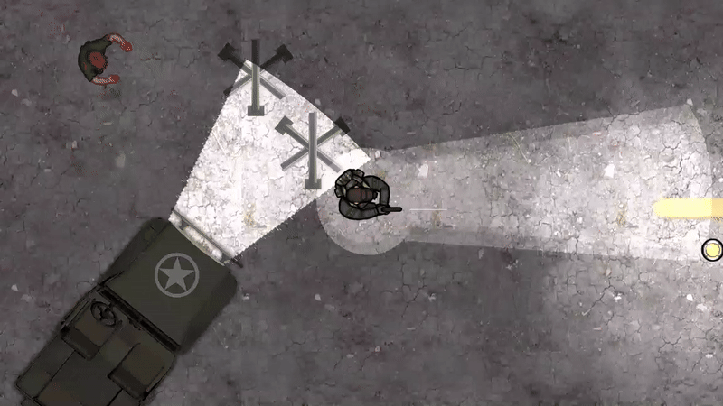
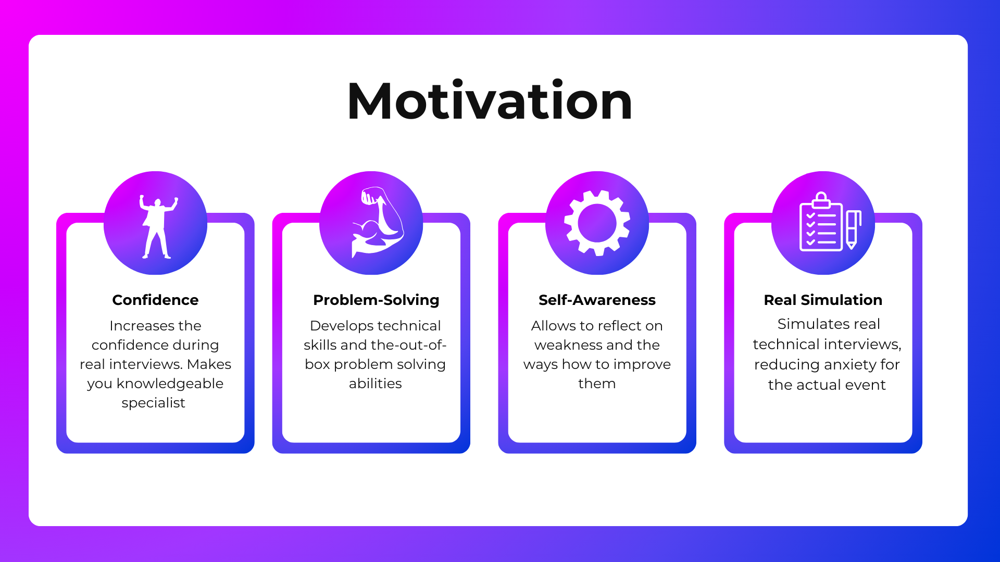
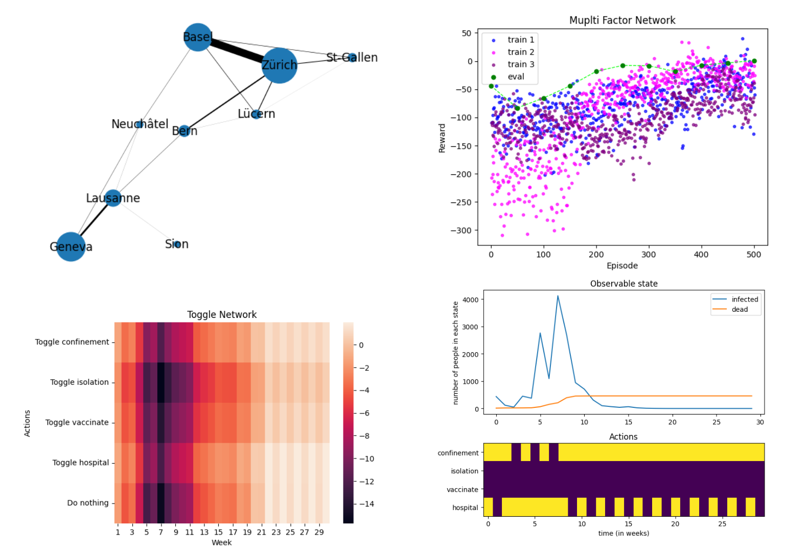

### ㅤ

### AI Navigation in Android Game
[Check out the post](https://dkarz.github.io/game-AI-navigation/)
-  Trained a DRL agent for enemy AI behavior in my mobile game
-  Designed an agent with perceptive inputs to enable adaptive navigation and obstacle avoidance
<figure >
  
</figure>

‎ 

---

‎ 

### Mock Interview AI Assistant - LauzHack Hackathon
[Code](https://github.com/BMehron/MockMaster_v1/tree/main)
- Used LangChain and OpenAI API to develop a bot simulating DS/ML interviews.

<figure>
  
</figure>

‎ 

---

‎ 

### Detoxification Alignment in Transformer Models
[Code](https://github.com/DKarz/detox-lang/blob/main/model_train_ddetox.ipynb)
- Fine-tuned T5 conditional generator on a dataset of rude Internet comments to handle negative inputs.
- Integrated a pre-trained transformer chat model from Hugging Face into a bot for message detoxification.

‎ 

---

‎ 

### Epidemic Mitigation with Reinforcement Learning - EPFL
[Code](https://colab.research.google.com/drive/1hK1tAh0FpOAyI1lwlC310UWIk3iCVD_4?usp=sharing)
- Implemented Deep Q-Network algorithm in PyTorch.
- Trained an agent acting in different epidemic scenarios in Switzerland.

<figure >
  
</figure>

‎ 

---

‎ 

### AI Anime Dubbing
- LauzHack Deepfake Hackathon, September 2024
<iframe width="560" height="315" src="https://www.youtube-nocookie.com/embed/6PiZsBiUkOI" 
        frameborder="0" allow="accelerometer; autoplay; clipboard-write; encrypted-media; gyroscope; picture-in-picture" 
        allowfullscreen>
</iframe>

